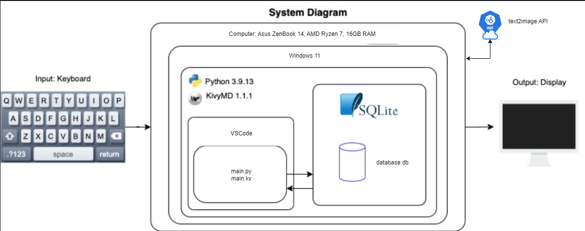

# GUI application for small business to manage their inventory and sales

# Criteria A: Planning
## Problem Definition
My client, who is an international businessman is planning on expanding his business in Frisbees. He needs a professional way not only to keep track of his orders and inventory but also an option to create a customizable item that will be added to the order. There is a need for accounts that the users can create with the key provided and log in with. After the login, the client himself and his closest coworkers can manage different orders, Finances, and inventory. The client also requires functionality to create new frisbees by choosing from different colors and shapes of disks. My client also wants to implement some marketing strategies such as a point system to keep customers entertained or special seasonal sales. Finally, the application is required to allow users to insert the name of a region they’re from, based on which there will be a specific image on the frisbee generated. This should solve the problem of a strenuous and inefficient paper-based system of keeping track of orders and lead to major time savings and error elimination.

## Proposed Solution
I’m proposing creating a GUI application because it’s going to allow the client and the customers to clearly and easily communicate. Information will be saved in a database for greater safety and fast access.[^1]

It was decided to use Python because it’s favored for GUI development due to its readable syntax, extensive libraries to choose from, cross-platform compatibility, robust community support, and seamless integration with other technologies. Its simplicity and versatility make it an excellent choice for creating graphical user interfaces for applications across different operating systems[^2]. Compared to the alternative C or C++, which share similar features, Python is a high-level programming language (HL) with high abstraction[^3]. For example, memory management is automatic in Python whereas it is the responsibility of the C/C++ developer to allocate and free up memory[^4], this could result in faster applications but also memory problems. In addition, an HL language will allow me and future developers to extend the solution or solve issues promptly.
Secondly, the choice was made to use KivyMD, a Material Design extension for the Kivy framework which offers a Pythonic solution for GUI development[^5]. Leveraging the simplicity of Python, KivyMD provides a set of pre-designed UI components with a modern Material Design aesthetic. This framework is known for its flexibility, and ability to create visually appealing and mainly responsive interfaces[^6].

Lastly, the preference for SQLite as the designated data storage solution, as opposed to alternatives like CSV files, online databases, and MySQL, is rooted in a thorough consideration of multiple factors. SQLite was selected due to its lightweight nature, making it an ideal choice for scenarios where a dedicated database server might be deemed excessive, particularly in the context of local hosting[^7]. Much like the rationale behind choosing Python for GUI development, SQLite aligns seamlessly with the project's requirements, offering simplicity, ease of use, and effortless integration across diverse platforms[^8]. The decision to opt for SQLite over CSV files ensures a structured and efficient data storage mechanism while favoring it over online databases and MySQL provides a self-contained, serverless solution with minimized dependencies[^9]. The avoidance of MySQL is particularly motivated by SQLite's suitability for local hosting, offering minimal configuration requirements, transactional capabilities, and reduced overhead without the need for a full-fledged database server[^10]. In essence, SQLite strikes a balance between simplicity, efficiency, and local hosting requirements, making it the optimal choice over MySQL and other alternatives.

[^1]: Rouse, Margaret. “Graphical User Interface.” Techopedia, 28 May 2021, www.techopedia.com/definition/5435/graphical-user-interface-gui. Accessed 4 Mar. 2024.
[^2]: Team, DataFlair. “What Is Python GUI Programming - Python Tkinter Tutorial - DataFlair.” DataFlair, 18 May 2018, www.data-flair.training/blogs/python-gui-programming/. Accessed 4 Mar. 2024.
[^3]: Python Geeks. “Advantages of Python | Disadvantages of Python.” Python Geeks, Python Geeks, 25 June 2021, www.pythongeeks.org/advantages-disadvantages-of-python/. Accessed 4 Mar. 2024.
[^4]: Real Python. “Python vs C++: Selecting the Right Tool for the Job.” Realpython.com, Real Python, 11 Sept. 2019, www.realpython.com/python-vs-cpp/#memory-management. Accessed 4 Mar. 2024.
[^5]: “KivyMD 2.0.1.Dev0 Documentation.” Readthedocs.io, 2022, www.kivymd.readthedocs.io/en/latest/. Accessed 4 Mar. 2024.
[^6]: GfG. “Building a Simple Application Using KivyMD in Python.” GeeksforGeeks, GeeksforGeeks, 12 May 2021, www.geeksforgeeks.org/building-a-simple-application-using-kivymd-in-python/. Accessed 4 Mar. 2024.
[^7]: “SQLite Home Page.” Sqlite.org, 2024, www.sqlite.org/. Accessed 4 Mar. 2024.
[^8]: “What Is MySQL? A Beginner-Friendly Explanation.” Kinsta®, 3 July 2023, kinsta.com/knowledgebase/what-is-mysql/. Accessed 4 Mar. 2024.
[^9]: “MySQL.” Mysql.com, 2024, www.mysql.com/. Accessed 4 Mar. 2024.
[^10]: GfG. “Difference between MySQL and SQLite.” GeeksforGeeks, GeeksforGeeks, 7 May 2020, www.geeksforgeeks.org/difference-between-mysql-and-sqlite/. Accessed 4 Mar. 2024.

## Design Statement
I will design a graphical user interface application. This application will be run locally on a computer and will allow users to do all mentioned tasks. All the data will be stored in also locally run database.

## Success Criteria
1. Solution provides a way for the user to create an item sold by the company from different materials
2. Solution provides a way to track transactions and keep track of the budget
3. Solution provides a way for the user of the software to view and delete orders.
4. Solution allows the user to sign in with a password and username and create new accounts for their employees
5. Solution informs the user of the time and date of the last log-in
6. Solution enables the user to create new distributors and customers, who can gather points based on which they get discounts
7. While creating an item, Solution allows to add an image generated based on the name of the region provided

# Criteria B: Design
## System Diagram

*Fig. 1 System Diagram of the app*
## Wireframe

*Fig. 2 wireframe diagram*
## Flow Diagram

*Fig. 3 Flow Diagram of the method crate_item of the CreateItemScreen class*

*Fig. 4 Flow Diagram of the method search of the DatabaseWorker class*

*Fig. 5 Flow Diagram of the method delete_selected of the ViewOrderScreen class*
## ER Diagram

*Fig. 6 ER Diagram of the database*
## UML Diagram

*Fig. 7 UML Diagram of the classes*

## Record of Tasks
| Task No. | Planned Action                                               | Planned Outcome                                                                                 | Time estimate (min) | Target completion date | Criteria |
|----------|--------------------------------------------------------------|-------------------------------------------------------------------------------------------------|---------------|------------------------|----------|
| 1 | Research on the best way to create a GUI application | A clear understanding of the best way to create a GUI application | 30 | 1/15/2024 | A |
| 2 | Research on the best way to create a database | A clear understanding of the best way to create a database | 60 | 1/16/2024 | A |
| 3 | Interviewing the client | A clear understanding of the problem and the requirements of the client | 90 | 1/17/2024 | A |
| 4 | Problem definition | Write a clear problem definition | 30 | 1/18/2024 | A |
| 5 | Proposed solution | Write a clear proposed solution | 60 | 1/19/2024 | A |
| 6 | Design statement | Write a clear design statement | 90 | 1/20/2024 | A |
| 7 | Success criteria | Write a clear success criteria | 30 | 1/21/2024 | A |
| 8 | Create a wireframe | A clear understanding of the structure of the final application | 60 | 1/22/2024 | B |
| 9 | Create ER diagram | A clear understanding of the structure of the database needed | 90 | 1/23/2024 | B |
| 10 | Create UML diagram | A clear understanding of the classes needed for the final application | 30 | 1/24/2024 | B |
| 11 | Create a system diagram | A clear understanding of the structure and deployment of the final application | 60 | 1/25/2024 | B |
| 12 | Set up the database | A database that is ready to be used | 90 | 1/26/2024 | C |
| 13 | Set up the GUI | Kivy and python files connected and ready to be used | 30 | 1/27/2024 | C |
| 14 | Create a login screen | A screen that allows the user to log in | 60 | 1/28/2024 | C |
| 15 | Create a registration screen | A screen that allows the user to create a new account | 90 | 1/29/2024 | C |
| 16 | Create a home screen | A screen that allows the user to navigate through the application | 30 | 1/30/2024 | C |
| 17 | Create a transaction screen | A screen that allows the user to create a new transaction and view and delete old ones | 60 | 1/31/2024 | C |
| 18 | Create an add customer screen | A screen that allows the user to add a new business partner | 90 | 2/1/2024 | C |
| 19 | Create a create item screen | A screen that allows the user to create a new item | 30 | 2/2/2024 | C |
| 20 | Create get image function | A function that allows the user to get an image based on the name of the region | 60 | 2/3/2024 | C |
| 21 | Create an image screen | A screen that allows the user to see the generated image to be printed on the item | 90 | 2/4/2024 | C |
| 22 | Create view orders screen | A screen that allows the user to view and delete all the orders | 30 | 2/5/2024 | C |
| 23 | Create a view parties screen | A screen that allows the user to view and delete all the customers and distributors | 60 | 2/6/2024 | C |
| 24 | Last log in function | Show the time and date of the last log in on the home screen after log in | 90 | 2/7/2024 | C |
| 25 | Password registration | Add a requirement for a password when creating a new account | 30 | 2/8/2024 | C |
| 26 | Distributor and customer points | Add a point system for the customers and distributors | 60 | 2/9/2024 | C |
| 27 | Budget tracking | Add a way to view the balance on the create transaction screen | 90 | 2/10/2024 | C |
| 28 | Documentation | A clear and well-documented function, classes of the project | 30 | 2/11/2024 | B |
| 29 | Testing | A clear and well-documented test plan and test results | 60 | 2/12/2024 | B |
| 30 | Design | Add background and colors to the application | 90 | 2/13/2024 | C |

## Test Plan
| Test No. | Test Type | Date | Procedure                  | Expected Outcome                |
|----------|-----------|------|----------------------------|---------------------------------------------------------------------------|
| 1 | Functional: Test whether the registration screen succesfully registers new user if all entries are valid. | 2/12/2024 | Run python file (main.py). Go to sign up screen and enter the following values: email: bob@isak, username: bob, password: bob123456, code: 1234 | When the database, database.db is checked, a new row of data in employees can be seen. This row shows the entered email, username, password and registration timestamp. |
| 2 | Functional: Test whether the login screen succesfully logs in user if all entries are valid. | 2/12/2024 | Run python file (main.py). Go to sign in screen and enter the following values: username: bob, password: bob123456 | The home screen should be displayed. |
| 3 | Functional: Test wheter the Register new bussines partner screen succesfully registers new bussines partner if all entries are valid. | 2/12/2024 | Run python file (main.py). Go to register new bussines partner screen and enter the following values: First name: bob, Last name: bober, email: bob@isak | When the database, database.db is checked, a new row of data in  parties can be seen. This row shows the entered first name, last name and email |
| 4 | Functional: Test whether the create new item screen succesfully creates new item if all entries are valid without image. | 2/12/2024 | Run python file (main.py). Go to create new item screen and enter the following values: customer: bob bobber, Type: putting, Quantity: 123, Color: red | When the database, database.db is checked, a new row of data in  items can be seen. This row shows the entered quantity, color, id of disc type and customer id, employee id and final price|
| 5 | Functional: Test whether the create new item screen succesfully creates new item if all entries are valid with image. | 2/12/2024 | Run python file (main.py). Go to create new item screen and enter the following values: customer: bob bobber, Type: putting, Quantity: 123, Color: red, Region: Europe | When the database, database.db is checked, a new row of data in  items can be seen. This row shows the entered quantity, color, id of disc type and customer id, employee id and final price. Also, the image of the disc should be displayed. |
| 6 | Functional: Test whether the create new transaction screen succesfully creates new transaction if all entries are valid. | 2/12/2024 | Run python file (main.py). Go to view and add transactions screen and enter the following values: sender: bob bobber, receiver: OUR COMPANY, amount: 1000 | When the database, database.db is checked, a new row of data in  transactions can be seen. This row shows the entered sender, receiver, amount, signature and id of employee responsible. Table on the screen also shows this information. |
| 7 | Functional: Test whether view and add transactions screen succesfully deletes transactions if the delete button is pressed. | 2/12/2024 | Run python file (main.py). Go to view and add transactions screen, select one order and press delete selected record button | When the database, database.db is checked, the selected record should be deleted. It should also disapear from the table on the screen. |
| 8 | Functional: Test whether view and add transactions screen succesfully shows all transactions. | 2/12/2024 | Run python file (main.py). Go to view and add transactions screen | Table on the screen should show all the transactions in the database. |
| 9 | Functional: Test whether delete all records button in view and add transactions screen succesfully deletes all transactions. | 2/12/2024 | Run python file (main.py). Go to view and add transactions screen and press delete all records button | When the database, database.db is checked, all the records should be deleted. Table on the screen should also be empty. |
| 10 | Functional: Test whether Summary button in view and add transactions screen succesfully shows the summary of all transactions. | 2/12/2024 | Run python file (main.py). Go to view and add transactions screen and press Summary button | A new window should pop up showing the balance and total spending and income. |
| 11 | Functional: Test whether the View bussines partners screen shows all bussines partners. | 2/12/2024 | Run python file (main.py). Go to view bussines partners screen | Table on the screen should show all the bussines partners in the database in the table parties. |
| 12 | Functional: Test whether the View order summary screen shows all orders. | 2/12/2024 | Run python file (main.py). Go to view order summary screen | Table on the screen should show all the orders in the database in the table orders. |
| 13 | Functional: Test wheter Log out button in home screen succesfully logs out the user. | 2/12/2024 | Run python file (main.py). Go to home screen and press Log out button | The log in screen should be displayed. |
| 14 | Integration: Test whether the application works as a whole. | 2/12/2024 | Run python file (main.py). Go through all the screens and try all the tests mentioned earlier | The application should pass all expectations in previous tests and should allow user to navigate between different screens easily. |
| 15 | Non-functional: Test the application's graphic interface with the client. | 2/12/2024 | Communicate with the client and show the application | The client should be satisfied with the graphic interface of the application. |
| 16 | Non-functional: Test the application's functionality with the client. | 2/12/2024 | Communicate with the client and show the application | The client should be satisfied with the functionality of the application. |


# Criteria C: Development
## Existing Tools
| Software/Development Tool      |
|--------------------------------|
| Python                         |
| VS Code                        |
| KivyMD                         |
| SQLite (reatlational database) |


| Libraries  |
|------------|
| Kivy       |
| KivyMD     |
| Requests   |
| Json       |
| sqlite3    |

## List Of Techniques Used
1. Functions (To have control of every action and not repeating the same for different parts of the code)
2. While Loops (To make sure that the sensor was recording data)
3. If else conditions (To send the data to the correct csv file and to the correct sensor in the server)
4. Classes (To have a clear structure of the code and to make it easier to read and understand)
5. Databases (To store the data and to make it easier to access it)
6. GUI (To make the application user-friendly and easy to use)
7. API (To get the data from the server and to send the data to the server)

## Development
### Code organization and database connection
The code is organized in a way that each screen of the application is a separate python class in the main.py file. Each one of these classes inherits from the ```MDScreen``` class from the KivyMD library. There is a class ```main``` that is the main class of the application which is a subclass of the ```MDApp``` class from the KivyMD library. The main class is responsible for running the application. KivyMD classes allow this code to connect to main.kv file which is responsible for the graphic interface of the application:
```kv
ScreenManager:
    id: screen_manager
    LoginScreen:
        id: login_screen
        name: 'LoginScreen'
    HomeScreen:
        id: home_screen
        name: 'HomeScreen'
    TableScreen:
        id: table_screen
        name: 'TableScreen'
    AddCustomerScreen:
        id: add_customer_screen
        name: 'AddCustomerScreen'
    RegistrationScreen:
        id: registration_screen
        name: 'RegistrationScreen'
    CreateItemScreen:
        id: create_item_screen
        name: 'CreateItemScreen'
    ViewOrderScreen:
        id: view_order_screen
        name: 'ViewOrderScreen'
    ViewPartiesScreen:
        id: view_parties_screen
        name: 'ViewPartiesScreen'
    ImageScreen:
        id: image_screen
        name: 'ImageScreen'
```

The database is a separate file called database.db. THere are ```create_disc.sql``` and ```table_setUp.sql``` files that are responsible for creating the database and setting up the tables in the database. The database is connected to the main.py file through the ```DatabaseWorker``` class. This class is responsible for all the communication with the database. It has methods for creating, reading, updating and deleting data from the database.
```sql
CREATE TABLE IF NOT EXISTS transactions (
  id INTEGER PRIMARY KEY,
  sender_id INTEGER REFERENCES parties(id),
  receiver_id INTEGER REFERENCES parties(id),
  amount INTEGER,
  signature TEXT,
  employee_id INTEGER REFERENCES employee(id)
);
```

This is an example of code that sets up the table transactions in the database. It creates a table with columns id, sender_id, receiver_id, amount, signature and employee_id. The sender_id, receiver_id and employee_id are foreign keys that reference the id column in the parties and employee tables. This is done to make sure that the data in the database is consistent and to avoid errors when deleting or updating data in the database.

### Succes criteria 1: creating items
Class ```CreateItemScreen``` is responsible for creating new items. It has methods to handle the events on the screen such as ```open_menu``` that is called when the user presses the menu button and shows custommers to choose from that it gets from the database.
```python
# This code defines a method called open_menu, which is used to open a dropdown menu.
# The method takes two parameters: self (referring to the instance of the class) and drop_item_element (the dropdown menu element).
def open_menu(self, drop_item_element):
    # Query the database to get a list of users
    users = main.x.search("SELECT first_name, last_name FROM parties", multiple=True)
    
    # Create a list of menu items by combining the first name and last name of each user
    self.menu_items = [f"{user[0]} {user[1]}" for user in users]
    
    # Create a list to store the menu buttons
    buttons_menu = []
    
    # Iterate over each menu item
    for item in self.menu_items:
        # Create a dictionary for each menu button with the following properties:
        # - text: the menu item text
        # - on_release: a lambda function that calls the button_pressed method with the menu item as an argument
        # - viewclass: the class used to display the menu item (OneLineListItem)
        buttons_menu.append(
            {
                "text": item,
                "on_release": lambda x=item: self.button_pressed(x, drop_item_element),
                "viewclass": "OneLineListItem",
            }
        )
    
    # Create an instance of MDDropdownMenu with the caller (drop_item_element) and the menu items
    self.menu = MDDropdownMenu(caller=drop_item_element, items=buttons_menu, width_mult=2)
    
    # Open the dropdown menu
    self.menu.open()
```
It also has a method ```create_item``` that is called when the user presses the create button. This method gets the data from the input fields on the screen and sends it to the database. It also calculates the final price of the item based on the quantity and the price of the disc type. It also gets the image of the disc based on the region provided by the user. This is a part of the code that handles the 
```python
points = main.x.search(f"SELECT points FROM parties WHERE id={customer_id}")[0]
price = 2500 * int(quantity)
if points >= 100:
    price -= 500
    main.x.run_query(f"UPDATE parties SET points={0} WHERE id={customer_id}")
    self.dialog = MDDialog(
        text=f"You have used your points, your order is 500 cheaper. The final price is {price}",
        size_hint=(0.7, 0.3),
    )
else:
    main.x.run_query(f"UPDATE parties SET points={points+10*int(quantity)} WHERE id={customer_id}")
    self.dialog = MDDialog(
        text=f"You have earned {10*int(quantity)} points for your order. You can use your points for a discount in your next order. Now you have {points+10*int(quantity)} points. The price is {price}",
        size_hint=(0.7, 0.3),
    )
self.dialog.open()
```
### Succes criteria 2: tracking transactions

### Succes criteria 3: tracking orders

### Succes criteria 4: login and registration

### Succes criteria 5: last log in

### Succes criteria 6: customer and distributor management, point system

### Succes criteria 7: image generation


